# ShuttleBot — Desktop Robotics & Free Live Web Detection

## Project screenshots

Total **15 clear feature screenshots** are shown below. Each screenshot is placed on its own line with a short note, so the UI stays large and easy to inspect in the README.

### 01. Original desktop realtime run

Shows the previously captured desktop realtime web run.

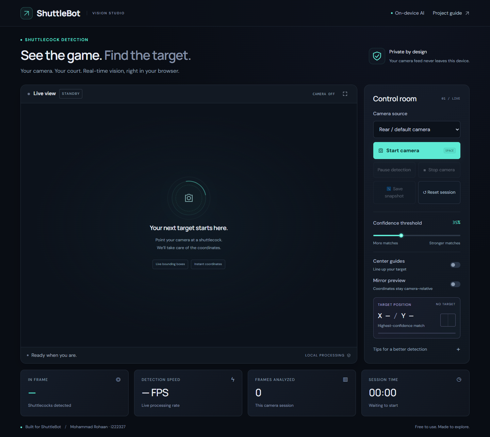

### 02. Original mobile realtime run

Shows the previously captured mobile realtime web run.

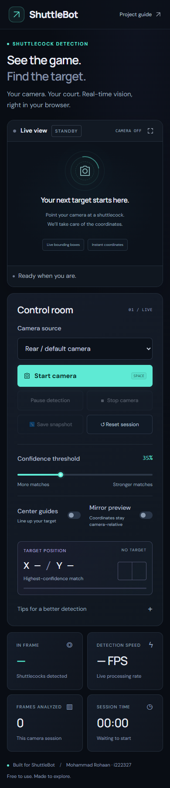

### 03. Web app desktop control room

Shows camera source, start/stop controls, confidence threshold, center guides, mirror preview, and target panel.

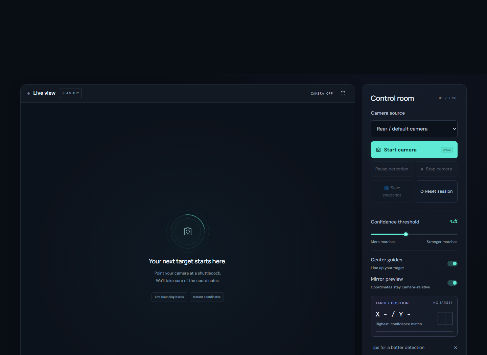

### 04. Web app desktop live detection

Shows the main browser detection view with shuttlecock boxes, live status, controls, coordinates, and target confidence.

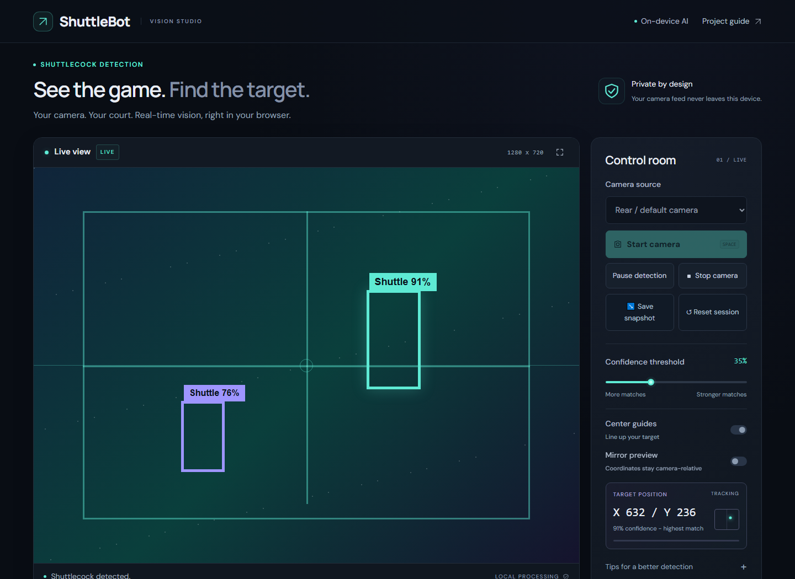

### 05. Web app desktop paused guides

Shows paused detection, center guide overlay, camera state, and controls while the feed remains visible.

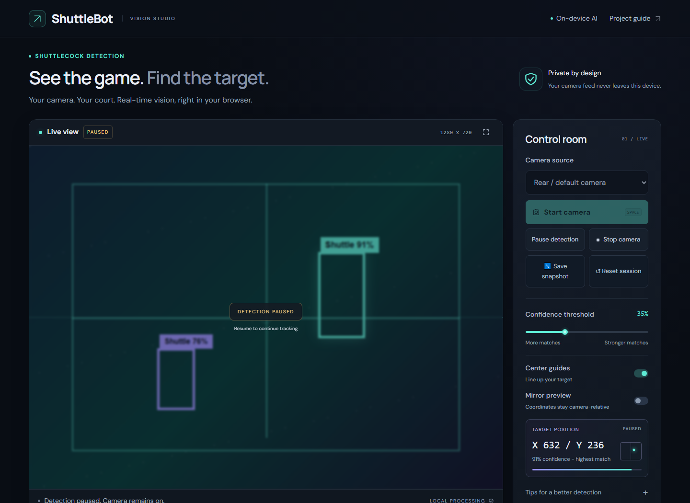

### 06. Web app desktop session metrics

Shows detection speed, frame count, session time, and tracking summary in a wide desktop layout.

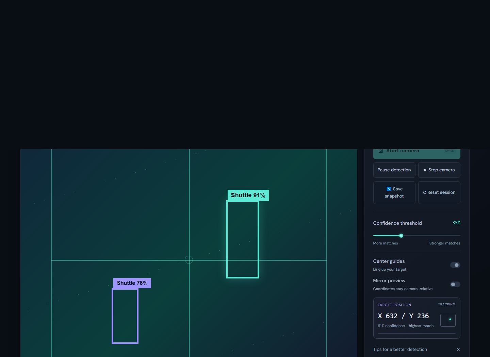

### 07. Web app mobile live camera

Shows the mobile camera stage with live shuttlecock detection boxes and responsive spacing.

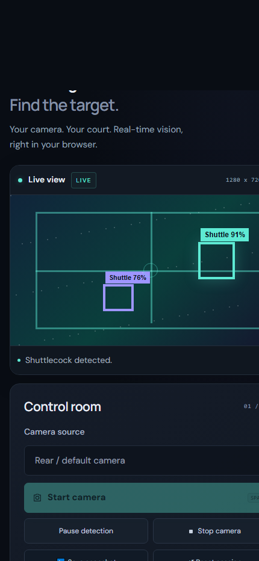

### 08. Web app mobile controls

Shows mobile camera controls, snapshot/reset actions, confidence slider, guides, and mirror toggle.

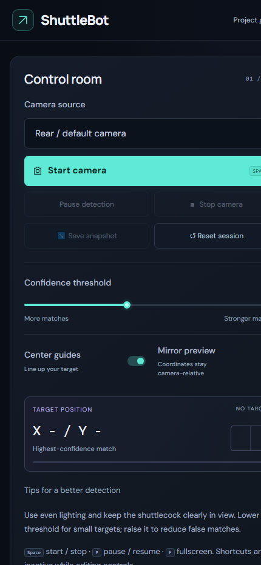

### 09. Web app mobile target telemetry

Shows mobile target coordinates, confidence, target position map, and paused tracking state.

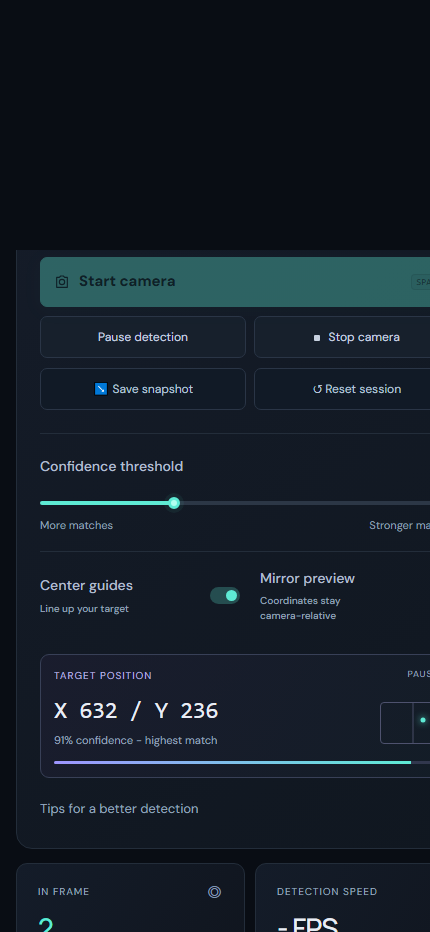

### 10. Web app mobile metrics

Shows mobile metric cards for detected shuttle count, FPS, frames analyzed, and session time.

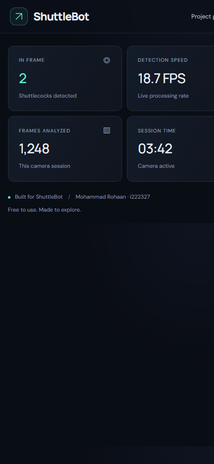

### 11. Offline desktop app search mode

Shows the OpenCV desktop app when no shuttlecock is detected and the robot action is `SEARCH`.

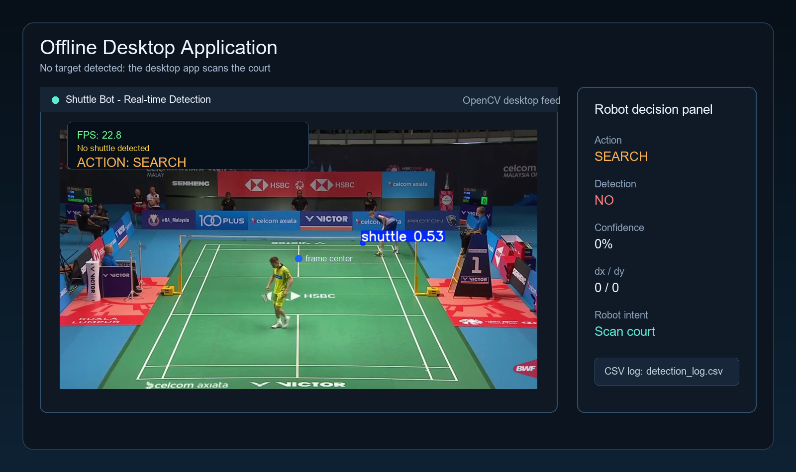

### 12. Offline desktop app turn left

Shows a left-side target with center error and the robot decision `TURN_LEFT`.

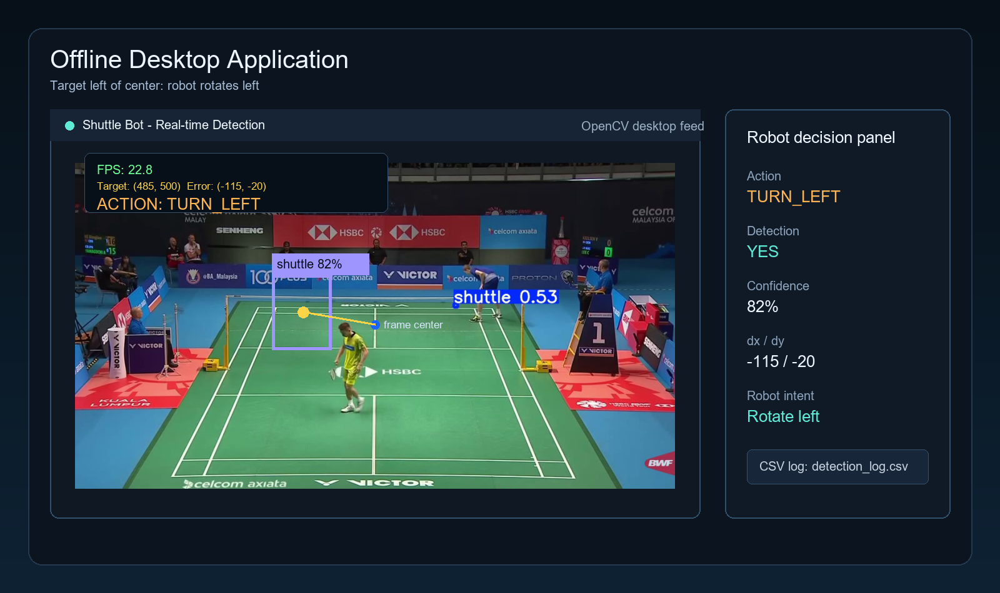

### 13. Offline desktop app turn right

Shows a right-side target with center error and the robot decision `TURN_RIGHT`.

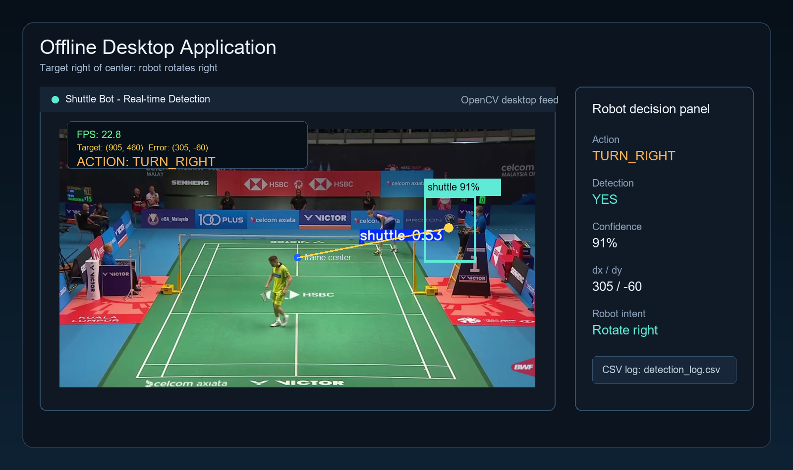

### 14. Offline desktop app move forward

Shows a centered target that is still far away, triggering the `FORWARD` action.

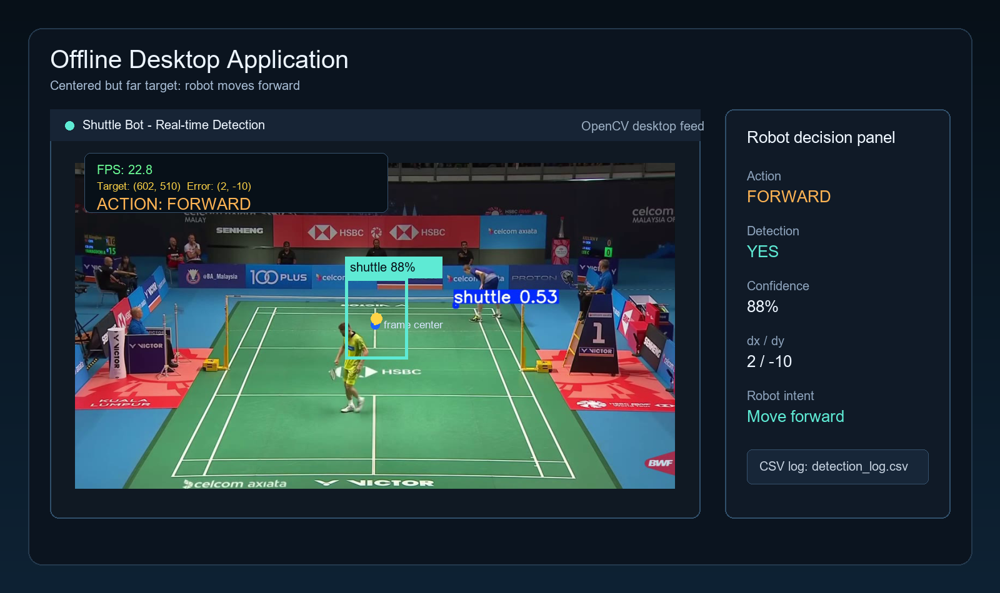

### 15. Offline desktop app pick and log

Shows a large centered target triggering `PICK`, with FPS, target error, confidence, and CSV logging visible.

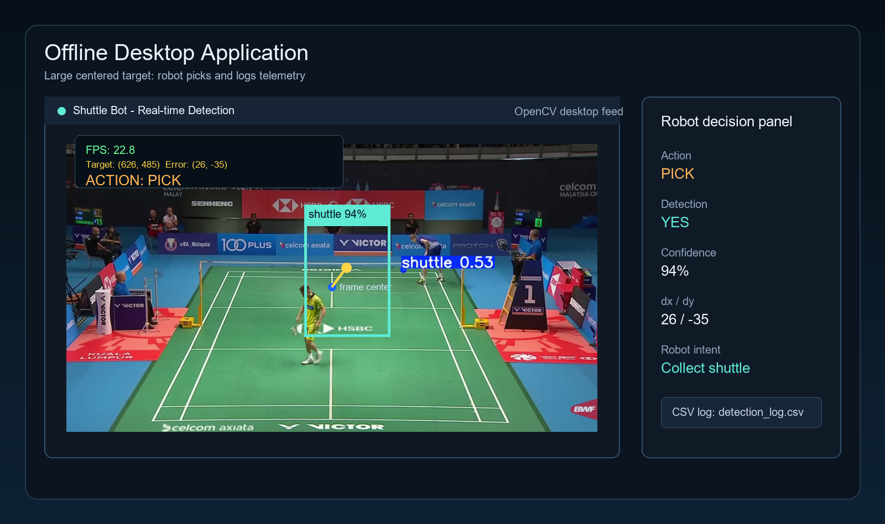

The documentation-only screenshot mode renders the committed static UI in deterministic states, so README captures do not require camera permission and do not record private camera frames.

## Simulation demo video

The simulation demo is available as an MP4 with controls. If GitHub does not autoplay the embedded player in your browser, click the poster or the direct video link below.

<video src="docs/videos/simulation-demo.mp4" poster="docs/videos/simulation-demo-poster.png" controls width="100%"></video>

[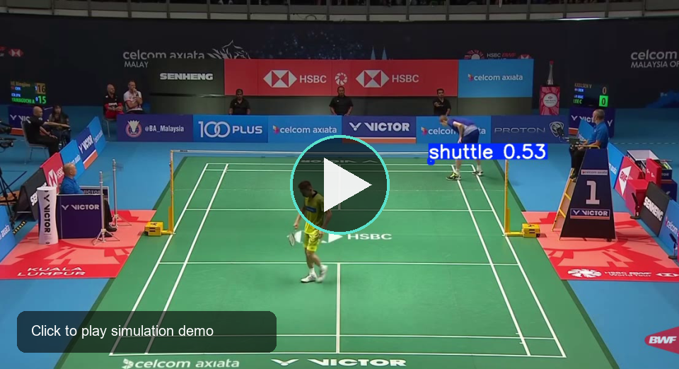](docs/videos/simulation-demo.mp4)

Direct video link: [docs/videos/simulation-demo.mp4](docs/videos/simulation-demo.mp4)

YOLOv8n shuttlecock detection for an autonomous badminton service robot.

## 🚀 Live Demo

### https://rohaan2802.github.io/ShuttleCock-Detection/

**Author:** Mohammad Rohaan · **Student ID:** i222327 · [GitHub](https://github.com/rohaan2802)

## Choose how to run

| Mode | Start | Processing | Features |
|---|---|---|---|
| Public web app | [Open live detector](https://rohaan2802.github.io/ShuttleCock-Detection/) | Visitor's browser | Live camera, boxes, confidence, coordinates; no uploads or CSV |
| Local web app | `python app.py web` or `run-web.bat` | Your browser | Same files and interface as the public website |
| Desktop robotics | `python app.py desktop` or `run-desktop.bat` | Python / OpenCV | Camera, boxes, robot action suggestions, CSV logs |
| Original Gradio app | `python app.py gradio` or existing `run.bat` | Local Python server | Original browser interface and detection |
| Browser model export | `python app.py export` | Local Python | Rebuilds ONNX from the canonical trained checkpoint |

`app.py` is the common launcher. The existing desktop and Gradio entry points still work directly. The Python application and JavaScript browser runtime use different execution formats of the **same trained model**, not separately trained models. GitHub Pages serves static files and cannot execute a Python `.py` file.

## Live camera demo

The browser app now has a dark **Vision Studio** interface with responsive controls and teal/violet highlights.

- **Pause / resume detection:** freezes analysis and the displayed frame while keeping the camera on. Use **Stop camera** to release the camera completely.
- **Fullscreen view:** expands the camera panel; use its button or Escape to return. Browsers without native fullscreen use an expanded in-page view.
- **Center guides and mirror preview:** align the subject or use a familiar selfie view. Mirroring changes the preview only; reported coordinates and the target map stay relative to the original camera image, and labels remain readable.
- **Camera source selection:** available device names appear after camera permission is granted. Stop the session before choosing another camera.
- **Live telemetry:** shuttle count, smoothed processing FPS, analyzed frames, session duration, target position map and confidence bar. Frame count and elapsed time remain visible after Stop and reset when a new session starts. Session duration includes paused time.
- **Save snapshot:** download the current annotated camera frame as a PNG while a session is active. **Reset session** clears the current telemetry and releases the camera.
- **Saved preferences:** confidence, center guides and mirror settings are stored locally in your browser. Camera frames and device IDs are never persisted by these preferences.
- **Keyboard controls:** Space starts/stops, P pauses/resumes and F expands the view. Shortcuts do not run while typing or interacting with form controls.

1. Open the live app in a modern browser with WebAssembly support (current Chrome, Edge, Firefox or Safari).
2. Choose rear/default or front camera, then click **Start camera** and allow access.
3. The detector downloads once for the session, then processes frames on your device. The initial model/runtime download is approximately 24 MB.
4. Hold a shuttlecock in good light. Boxes, confidence and the strongest match's center coordinates appear. Coordinates use the original camera image, with `(0, 0)` at its top-left.
5. Click **Stop camera** to release the camera. Switching away from the tab also stops capture; restart on return.

No account, payment card, paid inference API, Python installation or running owner laptop is needed for visitors. Camera frames are not uploaded or saved by this browser app. GitHub delivers the app/model files; Google Fonts supplies optional fonts. Device speed and lighting affect performance; fast motion, tiny targets and low-powered phones can reduce detection quality. This is a student demo, with no guaranteed FPS or service uptime.

## Local setup

Clone the repository and work from its root:

```bash
git clone https://github.com/rohaan2802/ShuttleCock-Detection.git
cd ShuttleCock-Detection
```

**Browser app:** only Python's standard library is needed to serve the committed files:

```bash
python app.py web
```

Open `http://localhost:8000`. For another port use `python app.py web --port 8080`; use `--no-browser` to suppress automatic browser opening. Use a local HTTP server instead of double-clicking `docs/index.html`, because model loading and camera permissions require an appropriate origin. Remote camera access requires HTTPS; localhost is supported for development.

**Desktop robotics:** Python 3.11 or 3.12 is recommended. Use a virtual environment:

```bash
python -m venv .venv
# Windows: .venv\Scripts\activate
# macOS/Linux: source .venv/bin/activate
python -m pip install -r requirements-desktop.txt
python app.py desktop
```

Press **q** to quit. Options are forwarded to the original detector:

```bash
python app.py desktop --camera-index 1 --conf 0.35 --imgsz 640
python app.py desktop --log-csv logs/session.csv
```

The desktop program displays `SEARCH`, `TURN_LEFT`, `TURN_RIGHT`, `FORWARD` or `PICK` based on target position and bounding-box area. These are suggested actions; this script does not send motor commands to an Arduino. Its CSV output includes coordinates, errors, confidence, action and FPS. Raspberry Pi deployment still needs compatible Python/OpenCV packages and a camera; Arduino/motor integration is separate.

**Original Gradio app:** install its dependencies in a separate virtual environment if possible, since headless OpenCV packages can conflict with desktop OpenCV's GUI support:

```bash
python -m pip install -r webapp/requirements.txt
python app.py gradio
```

Existing `run.bat` and `run-share.bat` retain their original behavior. A Gradio share link is temporary and requires the host computer to stay running. The public GitHub Pages app is independent of that Python server.

## One checkpoint, multiple runtimes

The source of truth is:

`ShuttleBotRealtime/models/shuttle_yolov8n_best.pt`

- Desktop uses this checkpoint by default, regardless of the shell's working directory.
- Gradio prefers this same checkpoint, with its old `webapp/models/` copy retained as a fallback for standalone legacy deployments.
- `docs/models/shuttle.onnx` is a generated browser copy, using fixed `[1, 3, 320, 320]` RGB input and raw `[1, 5, 2100]` single-class YOLOv8 output.
- `docs/models/shuttle.json` records source/export hashes, classes and preprocessing settings.
- Browser preprocessing uses letterboxing (padding 114), RGB values divided by 255, followed by confidence filtering and non-maximum suppression at IoU 0.5. Desktop defaults to 640px inference, so detections can differ from the 320px browser demo even though the weights are shared.

After updating/retraining the checkpoint:

```bash
python -m pip install -r requirements-export.txt
python app.py export
python tests/verify_export.py
```

Commit both the new ONNX file and JSON metadata with the checkpoint update. Do not edit generated ONNX files by hand. Training notebooks, result images, simulation scripts and robotics reports remain in the repository.

## Browser development and verification

The website is plain HTML/CSS/JavaScript, with ONNX Runtime Web **1.22.0** vendored under `docs/vendor/`. No cloud inference service or frontend build server is required.

```bash
npm ci --ignore-scripts
npm run vendor
npm test
python tests/verify_export.py
node tests/verify_wasm.mjs
```

The tests cover RGB tensor layout, letterboxing, coordinate recovery, confidence filtering, overlap suppression and malformed output. The Python verification compares exported predictions against the checkpoint on three repository sample images. The WASM check compares browser-runtime predictions against the Python ONNX reference and requires a real detection. Sample outputs stay in ignored `.test-output/`; these samples are existing repository images, not camera captures.

## GitHub Pages deployment & future updates

The Pages source is **main → /docs**. The live URL is:

**https://rohaan2802.github.io/ShuttleCock-Detection/**

In repository **Settings → Pages**, choose **Deploy from a branch**, branch **main**, folder **/docs**, and save. GitHub republishes the website after pushes to the publishing source. Check **Actions → pages build and deployment** for completion. Public GitHub Pages hosting on GitHub Free requires no paid compute service or payment card.

The repository remote should remain:

```bash
git remote -v
# origin https://github.com/rohaan2802/ShuttleCock-Detection.git
```

Keep README changes together with the code they describe. Review the diff, run the relevant checks, commit intended files, and push to `origin main`. Changes become online after the Pages deployment completes; files do not synchronize merely by being saved locally. Repository maintenance preferences are recorded in `AGENTS.md` for future coding sessions. Never commit credentials or force-push shared history.

## Repository map

| Path | Purpose |
|---|---|
| `app.py` | Common launcher for web, desktop, Gradio and export |
| `model_config.py` | Canonical checkpoint and export paths |
| `docs/` | Public static web app, ONNX model and runtime |
| `realtime_detect.py` | Original desktop robotics detector |
| `webapp/` | Original Gradio app and standalone deployment files |
| `scripts/export_browser_model.py` | Reproducible browser model export |
| `tests/` | Decoder and actual model verification |
| `Simulation.py` | Existing robot simulation |
| `i222327_ML_FINALPROJECT.ipynb` | Existing training notebook |
| `My Drive/ShuttleBot/` | Existing training and prediction artifacts |
| `LEGACY-GUIDE.md` | Historical desktop/Gradio guide and project background |

Older `DEPLOY*.md`, `render.yaml` and Docker configuration describe optional legacy Python hosting. **This README is the current guide for the free GitHub Pages deployment.** The model and Ultralytics dependencies retain their applicable original licensing; ONNX Runtime's license is included in `docs/vendor/LICENSE`.

## Troubleshooting

- **Camera blocked:** allow camera access in browser site settings, close other camera applications, then restart.
- **Blank model / load error:** allow the initial model download to finish and refresh. The site must include both `docs/models/` and `docs/vendor/`.
- **No detections:** improve lighting, bring the shuttle closer or lower the threshold. A clear view of the shuttle matters more than screen brightness.
- **Slow browser:** close other tabs and use a faster device. Frames are processed sequentially so inference does not build a backlog.
- **Desktop window fails:** use GUI-enabled `opencv-python` in a clean desktop virtual environment.
- **Old website after a push:** wait for the Pages deployment to succeed, then refresh the browser.

References: [GitHub Pages](https://docs.github.com/en/pages/getting-started-with-github-pages) · [Ultralytics export](https://docs.ultralytics.com/modes/export/) · [ONNX Runtime Web](https://onnxruntime.ai/docs/tutorials/web/)
